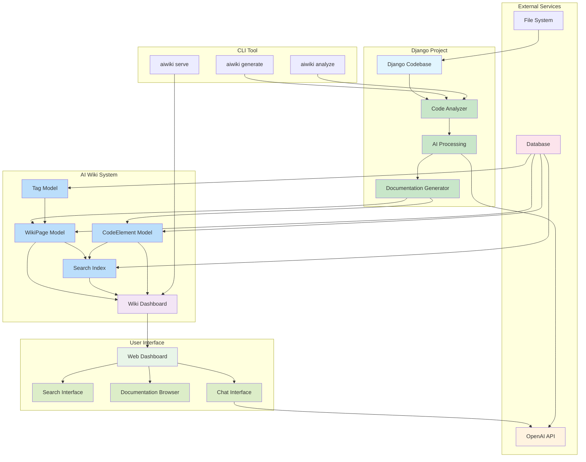

# Django AI Wiki - System Architecture Diagram

This diagram shows the overall architecture and data flow of the Django AI Wiki system.

## Architecture Components

### Core Components

1. **Code Analyzer**: Scans Django project files and extracts code elements
2. **AI Processing**: Uses OpenAI API to generate documentation content
3. **Documentation Generator**: Creates structured wiki pages from analyzed code
4. **Search Index**: Provides fast full-text search capabilities

### Data Models

- **WikiPage**: Stores generated documentation pages
- **CodeElement**: Represents individual code components
- **Tag**: Categorization system for documentation
- **SearchIndex**: Optimized search functionality

### User Interfaces

- **Web Dashboard**: Main interface for browsing documentation
- **Search Interface**: Advanced search with filters
- **Documentation Browser**: Hierarchical navigation
- **Chat Interface**: AI-powered Q&A about the codebase

### CLI Commands

- `aiwiki serve`: Starts the web dashboard server
- `aiwiki generate`: Generates documentation from codebase
- `aiwiki analyze`: Analyzes code structure and dependencies

## Data Flow

1. **Analysis Phase**: CLI tool scans Django project files
2. **Processing Phase**: AI analyzes code and generates documentation
3. **Storage Phase**: Documentation is stored in database models
4. **Serving Phase**: Web dashboard provides access to documentation
5. **Interaction Phase**: Users can search, browse, and chat about the code

## Technology Stack

- **Backend**: Django, Django REST Framework
- **Database**: PostgreSQL with full-text search
- **AI**: OpenAI GPT API
- **Frontend**: HTML, CSS, JavaScript, Mermaid.js
- **Server**: Flask (for dashboard), Gunicorn (for production)
